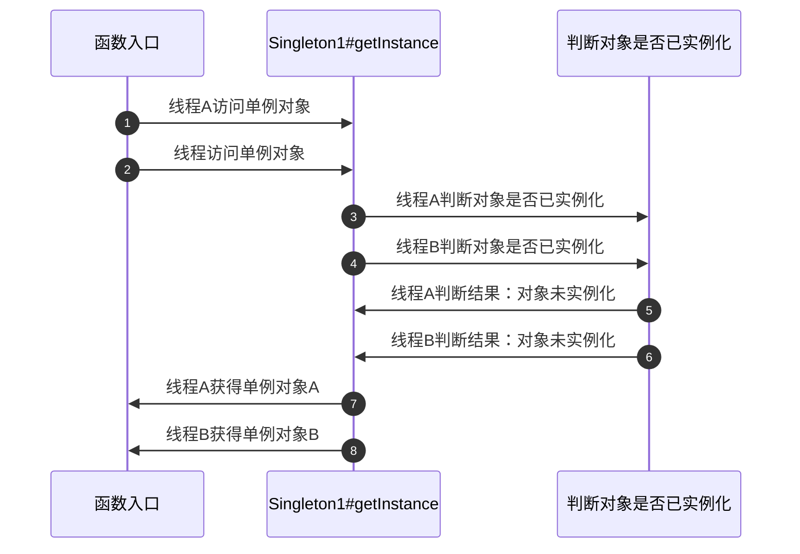

本文描述了单例模式的定义、应用场景以及它的七种实现方法，最后还分析了破坏单例模式的两种方式的原因以及解决方案。


## 1. 模式介绍

单例模式（Singleton Patter）可以算是 GOF 23种设计模式中最简单的一种模式了，它属于**创建型**模式。单例模式的定义也非常容易理解：**“一个类仅允许创建一个实例的模式被称为单例模式”**。


## 2. 应用场景

从单例模式的定义中我们可以很容易地联想到，当**一个类需要在整个系统中保持唯一存在**时，为了减少频繁创建、回收对象的不必要的性能消耗，我们就可以考虑使用单例模式来设计该类。


## 3. 实现方式

单例模式有很多种实现方式，最主要的有两种：懒汉式、饿汉式。

顾名思义，懒汉式就是说汉子特别懒，你叫我吃饭的时候我才入席。套用到单例模式中的意思就是，对象是延迟加载的，只有在被使用到时才会实例化对象。

同样的道理，饿汉式就是说汉子特别饿，早在被叫到之前就已经入席等待开饭了。套用到单例模式中的意思就是，对象在系统启动的时候就已经实例化了。


### 3.1 饿汉式(静态变量)

基于饿汉式实现单例模式的思路就是在类加载器加载类时就进行类的实例化。

````java
public class Singleton4 {

    private static Singleton4 instance = new Singleton4();

    private Singleton4() { }

    public static Singleton4 getInstance() {
        return instance;
    }
}
````

- 优点：基于类加载机制避免了多线程的同步问题，获取对象速度快（直接返回对象）
- 缺点：在类加载时就创建实例导致类加载慢，没有达到懒加载的效果，同时不能确定是否有其他方法导致二次类加载，打破单例限制


### 3.2 饿汉式(枚举类)

另外一种比较少见的基于饿汉式的单例是通过枚举类来实现。

```java
public enum Singleton6 {

    INSTANCE;

    // 业务方法
    public void serviceMethod() { }
}
```

- 优点：简单，枚举实例默认线程安全且为单例，同时反序列化不会生成新的对象
- 缺点：不适用于如配置文件场景下需要动态设置单例对象属性值的场景，同时不支持继承


### 3.3 懒汉式(线程不安全)

```java
public class Singleton1 {

    // 声明单例对象为private，并不进行实例化
    private static Singleton1 instance = null;

    // 声明类的构造方法访问权限为 private，使得无法在此类外进行实例化
    private Singleton1() { }

    // 获得单例对象的方法
    public static Singleton1 getInstance() {
        // 判断对象是否已实例化，没有实例化才 new 一个新的对象
        if (null == instance) {
            instance = new Singleton1();
        }
        return instance;
    }
}
```

线程不安全的懒汉式单例模式规定了只有在第一次调用 getInstance 方法的时候才进行对象的实例化，即支持**懒加载**。

而之所以说这个实现方式是线程不安全的，是因为在多线程环境下，可能会出现两个线程判断对象是否已实例化都为 true 的情况，即：



如上图所示，在多线程环境下，由于 getInstance 方法并非原子性方法，所以两个线程可以同时进入该方法，有可能造成存在多个实例化对象的情况。


### 3.4 懒汉式(线程安全)

为了解决第一种单例模式实现方式的缺陷，第二种单例模式实现方式——粗暴加锁的线程安全懒汉式。

```java
public class Singleton2 {

    // 声明单例对象为 private，并不进行实例化
    private static Singleton2 instance = null;

    // 同时声明类的构造方法为 private，使得无法在此类外进行实例化
    private Singleton2() { }

    // 获得单例对象的方法
    public static synchronized Singleton2 getInstance() {
        // 判断对象是否已实例化，没有实例化才new一个新的对象
        if (null == instance) {
            instance = new Singleton2();
        }
        return instance;
    }
}
```

第二种实现方式与第一种的唯一不同就是在 getInstance 方法的修饰符上，为了保证此方法的线程安全，给它加上了 synchronized 同步锁，保证同时只能有一个线程进入此方法。

但加了 synchronized 同步锁之后，就会导致开销变大，getInstance 方法效率低。


### 3.5 懒汉式(双重检查锁)

为了解决第二种线程安全的懒汉式单例实现方式中同步锁开销大效率低的问题，可以通过双重检查锁（DCL, Double Check Lock）的方式来解决。

```java
public class Singleton3 {

    // 声明单例对象为 private，并用 volatile 关键字修饰，保证可见性
    private static volatile Singleton3 instance = null;

    // 同时声明类的构造方法为 private，使得无法在此类外进行实例化
    private Singleton3() { }

    // 获得单例对象的方法
    public static Singleton3 getInstance() {
        // 判断对象是否已实例化，没有实例化才 new 一个新的对象，第一次判断是为了不必要的同步
        if (null == instance) {
            // 加锁，准备创建实例
            synchronized (Singleton3.class) {
                // 再次判断实例是否已被实例化
                if (null == instance) {
                    instance = new Singleton3();
                }
            }
        }
        return instance;
    }
}
```

DCL 的思路首先是在对象未被实例时才允许进行实例化。其次，在准备实例化对象前，为类加上 synchronize 同步锁，然后再次判断对象是否被实例化，此时依旧没有实例化才会真正开始实例化对象。

基于 DCL 的优化资源利用率较高，满足懒加载，减少了调用 getInstance 方法获取实例的耗时，但 DCL 可能会有失效的情况（CPU一直处于繁忙状态时）。


### 3.6 懒汉式(静态内部类)

基于懒汉式实现单例还有一种推荐的写法：静态内部类。

````java
public class Singleton5 {

    // 同时声明类的构造方法为 private，使得无法在此类外进行实例化
    private Singleton5() { }

    // 获得单例对象的方法
    public static Singleton5 getInstance(){
        return SingletonHolder.instance;
    }

    // 静态内部类，调用 getInstance 方法时，加载静态内部类，创建实例
    private static class SingletonHolder {
        private static final Singleton5 instance = new Singleton5();
    }
}
````

静态内部类形式是在单例类的静态内部类中声明单例对象，并实例化。

第一次加载类时并不会初始化单例类，而是在第一次调用 getInstance 时虚拟机加载静态内部类 SingletonHolder 并实例化单例对象，这样不仅能确保线程安全也能保证类的唯一性，所以推荐使用静态内部类单例模式。


### 3.7 基于容器实现单例

```java
public class Singleton7 {

    private static Map<String, Object> objMap = new HashMap<>();

    public static void registerService(String key, Object instance) {
        if (!objMap.containsKey(key)) {
            objMap.put(key, instance);
        }
    }

    public static Object getService(String key) {
        return objMap.get(key);
    }
}
```

例如，基于 HashMap 键不可重复的特性，我们可以实现简单的单例模式。但是这个 demo 中最大的问题就是线程不安全。

当然我们可以参考 Spring 中 BeanFactory 实现的单例模式，经受住了广大使用者的考验，更值得参考。


## 4. 验证单例模式

现在我们已经知道单例模式有以上七种实现方式，但是它们是否可行还需要验证，同时还需要确认单例模式是否会有一些隐患问题，所以下面我们会进行单例模式的验证，主要思路是基于 I/O 流先将单例对象序列化至本地文件中，然后读取文件反序列化到程序中，判断前后两个对象是否是同一个对象。


### 4.1 验证单例模式

验证单例模式的代码如下：

```java
public class SingletonSerializableCheck {

    /**
    * 序列化单例对象
    * 把对象转换为字节序列的过程称为对象的序列化
    * 
    * @param instance
    * @param filePath
    * @throws Exception
    */
    private static void writeEnum(Object instance, String filePath) throws Exception {
        ObjectOutputStream outputStream = new ObjectOutputStream(new FileOutputStream(new File(filePath)));
        outputStream.writeObject(instance);
        outputStream.close();
    }

    /**
    * 单例对象反序列化
    * 把字节序列恢复为对象的过程称为对象的反序列化
    *
    * @param filePath
    * @return Object
    * @throws Exception
    */
    private static Object readEnum(String filePath) throws Exception {
        ObjectInputStream inputStream = new ObjectInputStream(new FileInputStream(new File(filePath)));
        return inputStream.readObject();
    }
  
  	public static void main(String[] args) throws Exception {
        // 被检测的单例对象
      	// 此处 Singleton1.getInstance() 需要基于各个单例实现方式进行变化
        Object checkedSingletonObj = Singleton1.getInstance();
        // 文件路径
        String filePath = "SingletonEnumCheck.dat";
        // 序列化单例对象
        writeEnum(checkedSingletonObj, filePath);
        Object afterSerializableObj = readEnum(filePath);

      	// out：true，说明反序列化后，枚举类也是单例的；false，说明反序列化生成了新的对象
        System.out.println(checkedSingletonObj == afterSerializableObj);
    }
}
```

- 其他的单例模式写法会出现反序列化生成两个单例对象的情况，将上面验证代码声明单例对象改成 `Object checkedSingletonObj = Singleton1.getInstance();`，输出false，说明反序列化生成了新对象。

需要注意的是，在执行此验证方法前，需要确保以上七个单例类实现了 Serializable 接口，否则会产生序列化异常。经过此方法验证后的输出结果如下：

- 饿汉式(静态变量)：false
- 饿汉式(枚举类)：true
- 懒汉式(线程不安全)：false
- 懒汉式(线程安全)：false
- 懒汉式(双重检查锁)：false
- 懒汉式(静态内部类)：false
- 基于容器实现单例：false

可以看到，除了基于枚举实现的单例模式经过序列化反序列化后还是同一个对象，其他方式都生成了新的对象，这无疑是破坏了单例的特性。


### 4.2 反序列化破坏单例的原因

在读取文件，经过反序列化后，生成的对象与原来的单例对象并非一个对象，这其实是 I/O 流反序列化才导致的问题。

在跟踪 **java.io.ObjectInputStream#readObject()** 方法的过程中，其实有这样一段逻辑：

```java
java.io.ObjectInputStream#readObject()
  -> java.io.ObjectInputStream#readObject(java.lang.Class<?>) 501行
  	-> java.io.ObjectInputStream#readObject0 1665行
  		-> java.io.ObjectInputStream#readOrdinaryObject 2167行

	Object obj;
  try {
    // 是否可实例化，基于反射创建实例
    obj = desc.isInstantiable() ? desc.newInstance() : null;
  } catch (Exception ex) {
    throw (IOException) new InvalidClassException(
      desc.forClass().getName(),
      "unable to create instance").initCause(ex);
  }
```

对于反序列化将要返回的 obj 对象，首先会去判断单例类是否可实例化：

```java
desc.isInstantiable()

// java.io.ObjectStreamClass#isInstantiable
boolean isInstantiable() {
  requireInitialized();
  return (cons != null);
}

// cons 变量描述了类的默认构造器信息
private Constructor<?> cons;

// cons 的初始化方法 -> java.io.ObjectStreamClass#getSerializableConstructor
```

若单例类存在合适的无参构造方法，并且可实例化，那么 ObjectStreamClass 将通过反射新建一个单例类的实例，作为反序列化的结果返回，这就是反序列化后的对象与原对象不一致的原因。


### 4.3 如何避免反序列化破坏单例

在跟踪 **java.io.ObjectInputStream#readObject()** 方法的过程中，我发现有这样一个代码片段：

```java
java.io.ObjectInputStream#readObject()
  -> java.io.ObjectInputStream#readObject(java.lang.Class<?>) 501行
  	-> java.io.ObjectInputStream#readObject0 1665行
  		-> java.io.ObjectInputStream#readOrdinaryObject 2190行

if (obj != null &&
    handles.lookupException(passHandle) == null &&
    // 判断单例类是否存在 readResolve 方法
    desc.hasReadResolveMethod())
{
  // 调用目标类 readResolve 方法，返回 req 对象
  Object rep = desc.invokeReadResolve(obj);
  if (unshared && rep.getClass().isArray()) {
    rep = cloneArray(rep);
  }
  if (rep != obj) {
    // Filter the replacement object
    if (rep != null) {
      if (rep.getClass().isArray()) {
        filterCheck(rep.getClass(), Array.getLength(rep));
      } else {
        filterCheck(rep.getClass(), -1);
      }
    }
    // 将反序列化目标对象变更为 req 对象
    handles.setObject(passHandle, obj = rep);
  }
}
```

这个代码片段的意思是如果当前单例对象存在 **readResolve** 方法时，通过反射调用该方法得到一个 req 对象，将反序列化的对象变更为 req 对象。

至于为什么是 **readResolve** 方法，我们可以看一下 **java.io.ObjectStreamClass#hasReadResolveMethod** 的判断依据，它其实是通过一个 **readResolveMethod** 字段来判断的，而这个属性的初始化代码如下：

```java
java.io.ObjectStreamClass#ObjectStreamClass(java.lang.Class<?>)
  533行
  getInheritableMethod(cl, "readResolve", null, Object.class);
```

在这行代码中通过魔法值定义了这个 **readResolve** 方法。

在知道了这些信息之后，避免反序列化破坏单例的方法就很容易了：我们只需要在单例类中定义一个 **readResolve** 方法来控制对象的反序列化，这样就能实现反序列化返回对象与原对象保持一致。

```text
/**
* 控制反序列化，防止反序列化生成新对象
*
* @return Object
* @throws ObjectStreamException
*/
private Object readResolve() throws ObjectStreamException {
	// 返回单例对象
	return instance;
}
```

在将该方法添加到所有单例类中之后，再次运行验证代码，所有的返回结果都变成了 true，由此证实了新增 **readResolve** 方法能够避免反序列化破坏单例。


### 4.4 反射破坏单例

事实上，除了反序列化可以破坏单例之外，普通的单例类还可以通过反射来产生新对象，示例代码如下：

```java
public static void main(String[] args) throws Exception {
  // 获取单例对象
  Singleton1 s1 = Singleton1.getInstance();

  // 获取构造器，设置访问权限，创建新实例
  Constructor<Singleton1> constructor = Singleton1.class.getDeclaredConstructor();
  constructor.setAccessible(true);
  Singleton1 s2 = constructor.newInstance();

  System.out.println(s1 == s2);
}
```

程序输出的结果是：false，证明反射生成了新的对象，破坏了单例。

避免这个问题的方法很简单，从源头入手，反射是获取了单例类的构造方法，然后创建新的实例，所以只需要在单例类的构造方法中对单例对象进行校验即可，即：

```java
private Singleton1() {
  // 单例校验，避免反射创建新实例
  if (instance == null) {
    throw new RuntimeException("单例对象已存在!");
  }
}
```

在添加此逻辑后，程序的运行结果变成了：`Exception in thread "main" java.lang.RuntimeException: 单例对象已存在!`，证明确实避免了反射破坏单例的情况。


## 5. 小结

本文描述了单例模式的定义、应用场景以及它的七种实现方法，最后还分析了破坏单例模式的两种方式的原因以及解决方案。

单例模式的优点是可以保持对象在系统中的唯一性，能够节约资源。​

基于单例模式的定义，其缺点也显而易见：

- 单例类指责过重，不符合单一职责原则
- 缺少抽象层，难以扩展


## 6. 参考资料

- [5. 单例模式 — Graphic Design Patterns](https://design-patterns.readthedocs.io/zh_CN/latest/creational_patterns/singleton.html)
- [反射如何破坏单例模式](https://www.cnblogs.com/wyb628/p/6371827.html)
- [Java中使用容器实现单例模式](https://blog.csdn.net/vampirecoding/article/details/64926632)​

最后，本文收录于个人语雀知识库: [我所理解的后端技术](https://www.yuque.com/planeswalker/bankend)，欢迎来访。