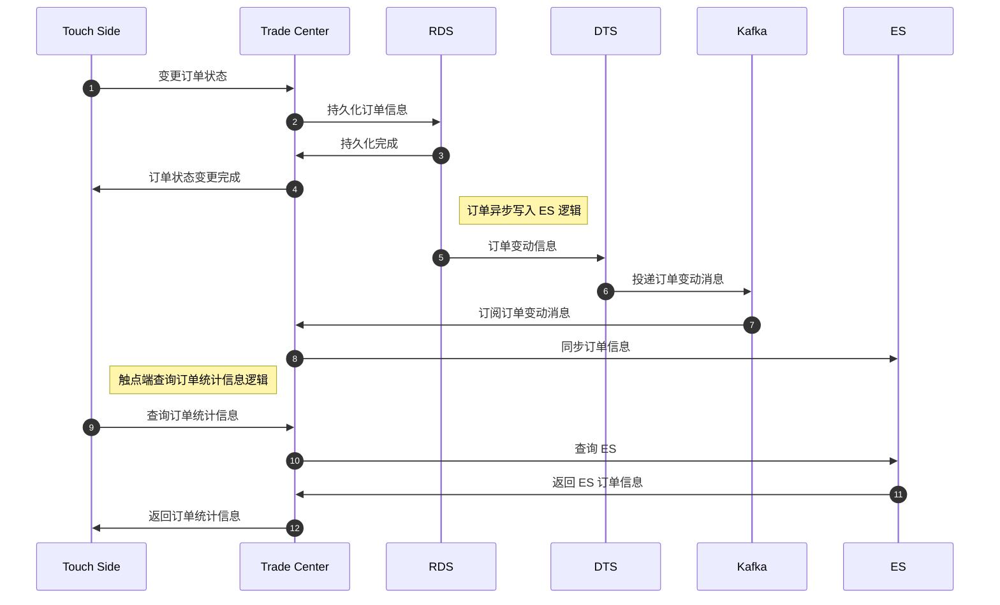
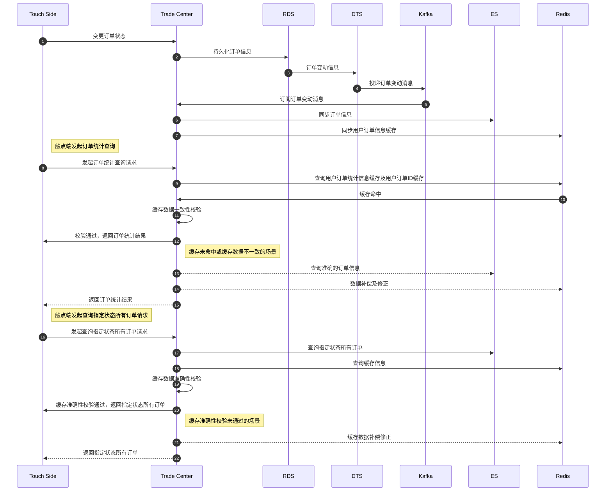
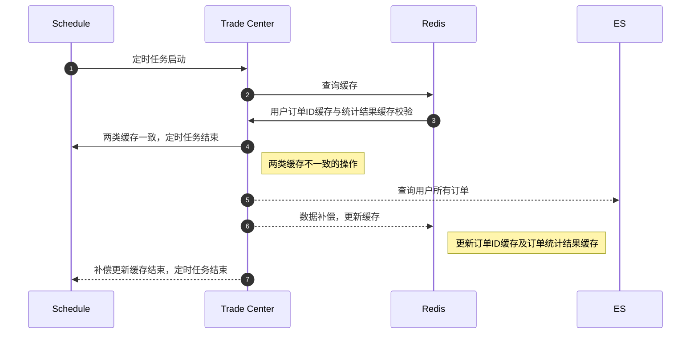
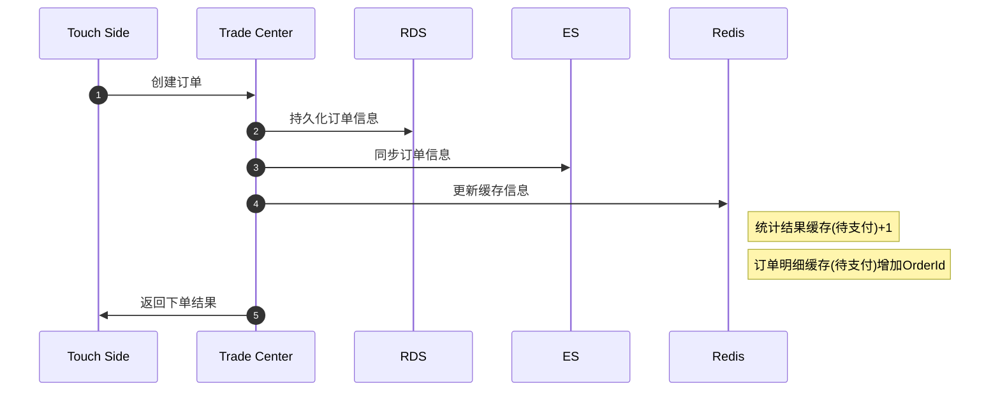
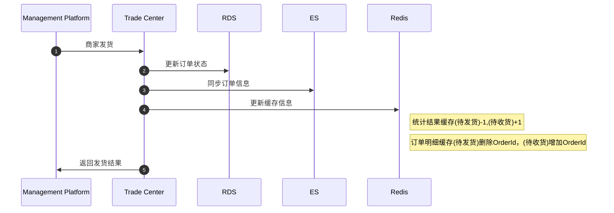
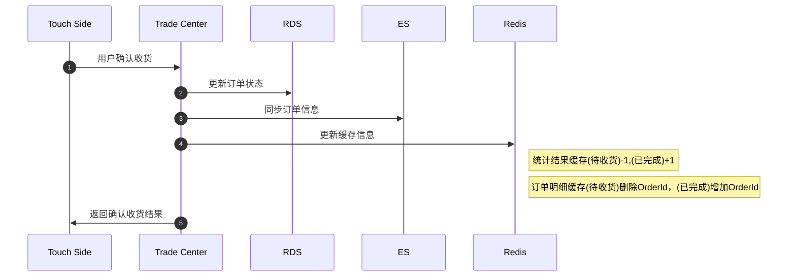
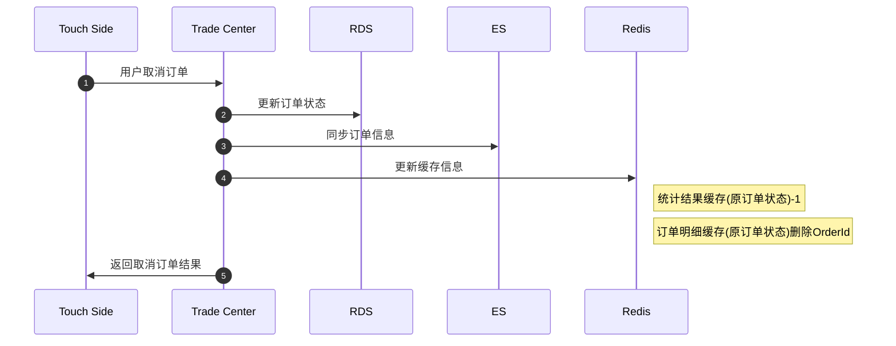

# 1. 场景描述
在客户性能压测现场支持时，遇到一个问题：用户订单状态统计接口响应时间（RT, Response Time）较长，成为项目整体性能的瓶颈，亟需优化。


用户订单状态统计接口是标品提供的能力，由于其业务复杂性及数据存储结构的特殊性（具体内容下文描述)，进行了多次 ES 的查询，导致 RT 较长，影响整体性能。

## 1.1 业务逻辑描述
标品原有的存储及查询逻辑是这样：

- 用户下单，RDS 进行持久化
- DTS 监听 bin log 变动，经由 Kafka 发送订单变更消息
- 交易中心监听并消费 Kafka 消息，将订单写入 ES
- 当触点端进行查询时，交易中心直接查询 ES 的订单数据返回


整体链路时序图如下：



## 1.2 核心问题
在标品原有的业务逻辑中，有这样两个问题是比较麻烦的：


### 1.2.1 订单状态映射关系
第一个是订单状态映射关系的复杂性，触点端需要展示的订单状态有：待支付、待发货、待收货、已完成。这些触点端订单状态是由多个持久化字段的状态共同决定的，其映射关系如下表：

| 触点端订单状态 | 持久化字段需满足的状态 |          |          |
| -------------- | ---------------------- | -------- | -------- |
|                | 支付状态               | 发货状态 | 收货状态 |
| 待支付         | 待支付                 |          |          |
| 待发货         | 已支付                 | 待发货   |          |
| 待收货         | 已支付                 | 已发货   | 未收货   |
| 已完成         |                        |          | 已收货   |

> Ps：私以为已完成状态的判断条件有待商榷，比如已完成，只要收货状态是已收货就可以吗？严格来说，已完成的状态应该同时满足：支付状态为已支付，发货状态为已发货，收货状态为已收货。不应该有“收货状态为已收货时必定意味着已支付、已发货”这样的约定，当约定太多时，可能会发生很多意料之外的情况。


### 1.2.2 ES 数据存储结构
交易中心在向 ES 写入数据时，其结构与 RDS 持久化的数据结构是一致的，也就是说，查询 ES 无法直接获得触点端需要的订单状态，这也是在查询订单统计结果需要多次查询 ES 的原因。


由于 ES 中存储的数据与 RDS 持久化的数据结构，我们可以把 ES 看成是一个更快的 MySQL，当我们查询用户 id=1 的待收货订单数量时，SQL 语句如下：
```sql
select count(*) from order where user_id = 1 and `支付状态`='已支付' and `发货状态`='已发货' and `收货状态`='未收货';
```


而如果我们需要同时查询到四种订单状态的数量，那么只能通过四次查询获得：
```sql
-- 待支付
select count(*) from order where user_id = 1 and `支付状态`='待支付';

-- 待发货
select count(*) from order where user_id = 1 and `支付状态`='已支付' and `发货状态`='待发货';

-- 待收货
select count(*) from order where user_id = 1 and `支付状态`='已支付' and `发货状态`='已发货' and `收货状态`='未收货';

-- 已完成
select count(*) from order where user_id = 1 and `支付状态`='已支付' and `发货状态`='已发货' and `收货状态`='已收货';
```


这就是整个用户订单统计结果接口 RT 较长的原因。


# 2. 解决方案
基于上述的业务及核心问题分析，我们提出了以下几种解法：


## 2.1 修改 ES 存储数据结构
**每条数据新增一个订单状态字段**，然后再写入 ES。


这样就将原本要N次的查询减少到了1次，并且仅需要将订单状态作为查询条件即可。但是，基于种种无法描述的原因，这个方案被放弃了（主要的原因还是尽量不对标品做大改动）。


## 2.2 新增缓存机制
在摒弃了第一种方案之后，我们又提出第二种解决方案：**缓存**，对用户订单统计结果做缓存。


这样就不需要每次都对 ES 进行N次查询然后再组装结果集进行返回了。但是，缓存的准确性和健壮性是一个需要考虑的问题：

- 如何在异步场景下保证数据的准确性，不被例如重复消费的场景影响缓存数据？
- 如何让缓存数据具备健壮性？即假设缓存有误，如何在没有后台干预的情况下让缓存数据能够自我修正？
- 如何在特定场景下使得缓存能够持续命中（如性能压测）？
- ……

这些都是在设计缓存机制时需要考虑的问题。


# 3. 详细设计
## 3.1 缓存流程设计
在确定了基于缓存对本场景进行优化的方向之后，首先需要确定的是优化后整体的业务流程，前面几个步骤不变，还是：

- 用户下单，RDS 进行持久化
- DTS 监听 bin log 变动，经由 Kafka 发送订单变更消息
- 交易中心监听并消费 Kafka 消息，将订单写入 ES


新增了同步缓存的步骤：

- 交易中心将订单信息同步至缓存


当触点端进行订单统计查询时，首先查询缓存，需要分情况讨论：

- 第一次查询（缓存未命中）
   - 交易中心直接查询 ES 的订单数据
   - 将查询结果缓存，缓存分两类
      - 用户订单统计结果缓存：缓存了各状态订单数量
      - 用户订单ID缓存：缓存了各状态订单ID值
   - 返回查询结果至触点端
- 第N次查询（缓存命中），这里也需要分情况讨论
   - 两类缓存一致
      - 返回查询结果至触点端
   - 两类缓存不一致
      - 交易中心直接查询 ES 的订单数据
      - 修正缓存，将查询结果更新至缓存
      - 返回查询结果至触点端


除此之外，我们还在用户查询指定状态所有订单时，对缓存进行准确性校验及补偿：

- 触点端查询指定状态所有订单
- 交易中心查询 ES 中指定状态所有订单
- 判断与缓存中数据是否一致
   - 若不一致，对缓存中的数据进行补偿更新
- 返回指定状态所有订单至触点端



## 3.2 Redis 数据结构设计
在客户的项目中使用的缓存中间件是 Redis。


在缓存设计中提到，我们会将缓存分为两类，其含义及数据结构如下：

- 用户订单统计结果缓存：缓存了各状态订单数量
   - Redis 数据结构（Hash）
   - 键：UserOrderCountCache:userId
   - 值：(订单状态:统计数量结果)
- 用户订单ID缓存：缓存了各状态订单ID值
   - Redis 数据结构（Zset）
   - 键：UserOrderDetailCache:userId:订单状态
   - 值：(订单ID)


## 3.3 补偿机制设计
基于对缓存的不信任，我们设计了两种补偿机制。


### 3.3.1 主动补偿

- 查询订单统计信息（Redis 缓存内部修正）

  ```mermaid
  sequenceDiagram
      autonumber
  		Touch Side ->> Trade Center: 发送订单统计查询请求
  		Trade Center ->> ES: 第1次查询
  		ES ->> Trade Center: 返回订单统计查询结果
  		Trade Center ->> Redis: 第N次查询
  		Redis ->> Trade Center: 订单ID缓存与订单统计结果缓存校验
  		Trade Center ->> Touch Side: 两类缓存一致，返回查询结果
  		Note right of Trade Center: 两类缓存不一致的操作
  		Trade Center -->> ES: 查询用户所有订单
  		Trade Center -->> Redis: 数据补偿，更新缓存
  		Note right of Redis: 更新订单ID缓存及订单统计结果缓存
  
  		Trade Center -->> Touch Side: 补偿更新缓存结束，返回订单统计查询结果
  ```

  

- 查询指定状态所有订单（懒加载主动补偿修正）

  ```mermaid
  sequenceDiagram
      autonumber
  		Touch Side ->> Trade Center: 发送查询指定状态所有订单请求
  		Trade Center ->> ES: 查询指定订单状态的订单信息
  		Trade Center ->> Redis: 查询用户订单ID缓存与统计结果缓存
  		Trade Center ->> Trade Center: 缓存准确性校验
  		Trade Center ->> Touch Side: 缓存准确，返回查询结果
  		Note right of Trade Center: 缓存不准确的操作
  		Trade Center -->> Redis: 数据补偿，更新缓存
  		Note right of Redis: 更新订单ID缓存及订单统计结果缓存
  
  		Trade Center -->> Touch Side: 补偿更新缓存结束，返回查询指定状态所有订单结果
  ```

  

### 3.3.2 定时补偿
基于定时任务，进行两类缓存的一致性判断，若不一致查询 ES 进行缓存补偿更新。




## 3.4  论证及说明
### 3.4.1 两类缓存是否过度设计
设计两类缓存的目的是为了**防止重复消费**。


假设有一条用户下单的消息被重复消费了，如果只设计了一种缓存（订单统计结果），那么在消费 Kafka 消息更新缓存数据时，订单统计结果将会+2，导致缓存数据异常。


而如果按照现在的设计有两种缓存时，就算用户订单统计结果缓存中数据异常，但是由于用户订单ID缓存存储的是订单 ID，所以不会产生重复数据，能够再用户进行下一次查询时识别到本次命中的缓存数据是错误的，从而走 ES 的查询。


### 3.4.2 对缓存进行计算是否合理
可能有人会说，对缓存结果进行计算是不安全的，假设不是重复消费而是在消费消息时在某种情况下导致 ES 中同步了订单信息，但缓存中数据丢失的情况怎么办？此时两类缓存的数据是一致的，并不会走 ES 查询，这就导致了向触点端返回了错误的数据。

确实，是存在这种可能的，所以当触点端查询指定状态所有订单时（如下图的查询所有代付款订单），我们追加了一种**主动补偿机制。**


这种**主动补偿机制**是基于查询指定状态所有订单的结果一定是准确的，其工作原理是在得到查询结果后并不直接返回，而是对缓存数据进行一次查询并校验准确性，如查询结果与缓存不一致，说明缓存数据是错误的，需要对缓存进行补偿修正。


# 4. 主要场景时序图
本部分时序图主要是为了枚举出所有业务场景，将交易中心基于各种场景需要对缓存进行的操作一一列举。


## 4.1 用户下单(创建订单)
> 省略 DTS/Kafka 等非核心节点




## 4.2 用户支付(订单状态变更)
> 省略 DTS/Kafka 等非核心节点


## 4.3 商家发货(订单状态变更)
> 省略 DTS/Kafka 等非核心节点




## 4.4 用户确认收货(订单状态变更)
> 省略 DTS/Kafka 等非核心节点




## 4.5 用户退货(取消订单)
> 省略 DTS/Kafka 等非核心节点




# 5. 兜底方案

- 定时任务：定时补偿修正所有缓存
- 开放补偿接口：主动调用补偿接口修正（指定/所有）缓存
  - 以批任务的形式防止出现慢 SQL 打爆数据库导致服务不可用


至此，本次分享到此结束，感谢。最后，本文收录于个人语雀知识库: [我所理解的后端技术](https://www.yuque.com/planeswalker/bankend)，欢迎来访。