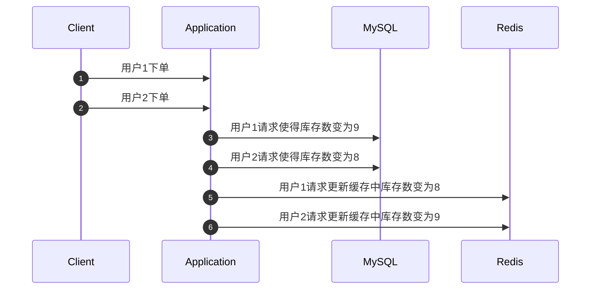
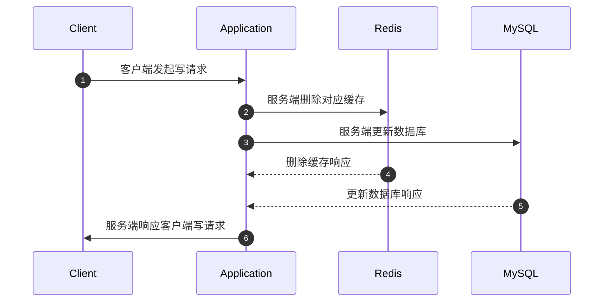
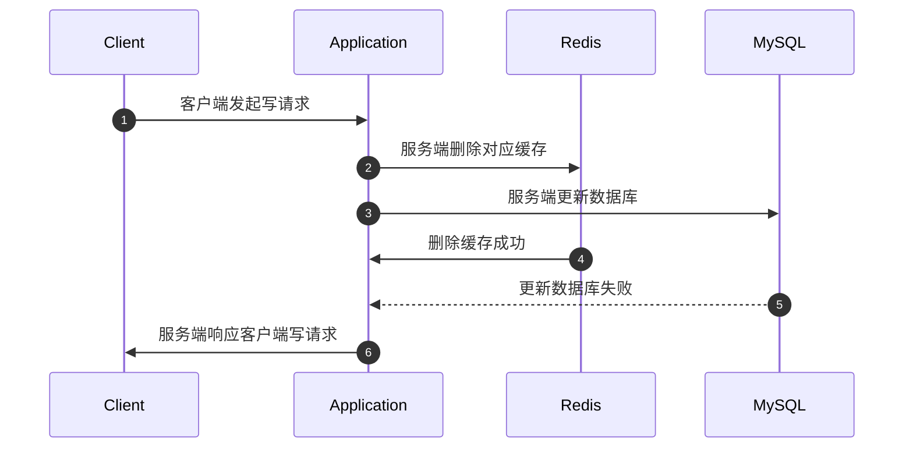
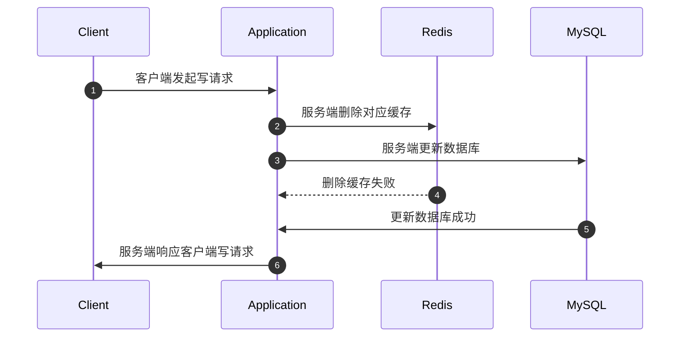
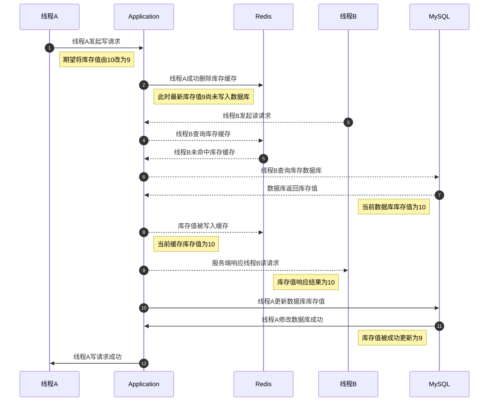
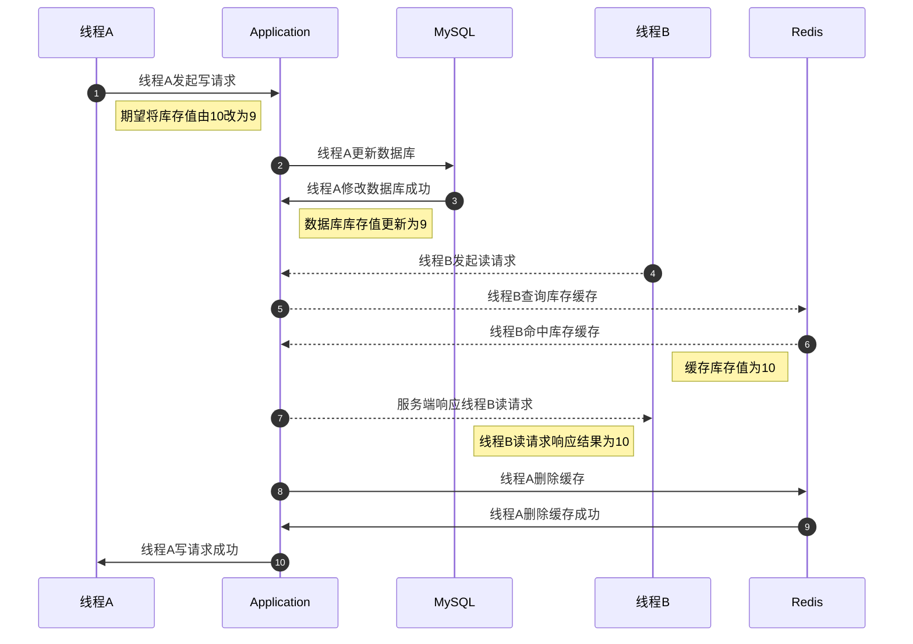

本文的主要议题是缓存一致性问题，包括 Redis 常用读写策略、为什么会存在缓存不一致的场景、如何保证数据库与缓存的一致性。

## 1. 开篇词

记得很早之前有个阿里面试官就问我数据库与缓存的一致性问题该怎么解决，恰逢当时刚刷完极客时间蒋德均老师的《Redis 核心技术与实战》，里面有一个章节讲的就是缓存一致性问题的前世今生。我就从一致性问题的起因到发生数据不一致的各种极限场景都给面试官一一举例，说得他一愣一愣的，给他好好上了一课。

这轮面试当然是通过了，最后因为薪资没谈拢，拒绝了他们给出的 Offer，可能是缘分未到吧，扯远了。

本文的主要议题是缓存一致性问题，包括 Redis 常用读写策略、为什么会存在缓存不一致的场景、如何保证数据库与缓存的一致性。

话不多说，进入正题。

## 2. 旁路缓存模式

我们在使用 Redis 作为缓存时，一般会采用**旁路缓存模式**（Cache Aside Pattern）作为 Redis 缓存的读写策略。

旁路缓存模式其实就是在客户端与数据库之间加上一层缓存，在读取数据时先读缓存中的值，在写数据时也需要同时维护缓存中的数据。这里的「维护」可以是删除缓存，也可以是更新缓存，但一般我们使用前者，能更大地保证数据的一致性。

为了更好地理解旁路缓存模式，这里画一下读数据及写数据两种场景的流程图。

### 2.1 旁路缓存模式读流程

- 客户端发起读请求，首先查询缓存，若命中缓存，直接返回缓存数据
- 若未命中缓存，查询数据库数据，将数据库查询结果更新至缓存，然后返回响应结果至客户端

### 2.2 旁路缓存模式写流程

- 客户端发起写请求，数据写入数据库，然后将缓存中对应数据删除

可能有的同学会问了：为什么在写数据的时候是删除对应的缓存内容而不是更新缓存数据呢？

这就涉及到缓存与数据库的一致性问题了，我们可以把缓存与数据库看成是两个毫不相干的中间件，他们没有像数据库事务中原子性的概念，所以在处理业务的过程中很可能发生数据库处理成功，缓存处理失败的场景。此外，也可能由于更新缓存顺序导致缓存与数据库数据不一致的问题。

下面一一列举。

### 2.3 更新缓存的异常情况

首先列举由于更新缓存顺序导致缓存与数据库数据不一致的情况。

假设有一个商品的库存数为10，分别存储在数据和缓存中，现在有两个用户分别买了一件商品，所以需要对库存进行扣减。用户1下单使得库存数由10变为9，用户2下单使得库存数由9变为8，最终库存数应该是8。

按照旁路缓存模式写流程的描述中，在更新完数据库后是需要更新缓存中对应的数据的，但是在两次请求更新完数据库后，向 Redis 同步更新数据的过程中发生了一些意外：用户1更新缓存请求要晚于用户2更新缓存的请求。这就导致了最终缓存中的库存数是9，也就发生了缓存于数据库数据不一致的场景。

上述异常流程如下图：

而第二种异常流程是更新完数据库后，更新缓存的请求都失败了，这最终会导致缓存的数据还是10，后续读请求读到的库存数据将是错误的，同样也导致了缓存与数据库数据不一致。

所以，我们在使用旁路缓存模式时，一般会采取**更新数据库数据，同时删除对应缓存数据**的方法保证数据库与缓存数据的一致性。

但事实上，还是会存在某些极限场景，会导致数据库与缓存不一致，这也是本文讨论的重点。

## 3. 缓存一致性

前文中所描述的缓存一致性是指数据库数据与缓存数据的一致性，这里的一致性其实包括了两种情况：

- 缓存命中时，要保证缓存数据与数据库数据一致
- 缓存未命中时，要保证从数据库加载的数据应该是最新版本，即不能出现先将数据加载到缓存，然后再更新数据库的情况

## 4. 数据库与缓存不一致场景

在描述旁路缓存模式时，我刻意模糊了写请求情况下更新数据库与删除缓存的时序，因为不同的情况会有不同的问题。也就是各种缓存不一致的场景，下面来具体分析。

### 4.1 先删除缓存，再更新数据库

第一种情况就是先删除缓存，再更新数据库，这种情况的时序图如下所示：

在上面的时序图中，我画了两条虚线，这代表着可能会出现异常的地方，即删除缓存失败、更新数据库失败，在两种情况下，就会分为多种不同的缓存不一致场景：

#### 4.1.1 删除缓存成功，更新数据库失败

 删除缓存成功，更新数据库失败场景的时序图如下：

这种异常场景导致的结果是：缓存频繁失效，数据库写入异常。从用户的角度来说，就是操作完之后数据一直是不变的。

当然这种场景是由于数据库服务异常导致的，无论有没有缓存，这种异常场景都是需要运维人员到线上环境去检查数据库服务的，跟数据一致性问题关系不大，这里只是作为一种异常情况列举出来。

#### 4.1.2 删除缓存失败，更新数据库成功

 删除缓存失败，更新数据库成功场景的时序图如下：

这种异常场景导致的结果是：数据库正常更新，但缓存一直是旧值。这里就是一种数据库数据与缓存数据不一致的场景了。后续再有读请求时，将会命中缓存中存储的旧值。

当然这种场景是由于缓存服务异常导致的，当有大量数据问题反馈时，运维人员需要去线上检查缓存服务。这虽然是属于缓存不一致场景，跟缓存读写策略没有太大关系，这里同样只是作为一种异常场景列举出来。

#### 4.1.3 并发场景

上面两种情况讨论的是缓存服务或数据库服务异常的情况，而这种情况一般来说不太可能发生，就算发生了也有服务提供商背锅，开发人员无需太过担忧，只要尽快恢复服务即可。接下来要说的多线程并发导致的缓存不一致情况才是开发人员真正需要关注的。

假设缓存服务和数据库服务都是正常的，在并发场景下也可能存在异常情况：**线程A删除缓存成功，但尚未更新数据库数据，此时有线程B发起读请求，发现缓存未命中，然后从数据库加载数据到缓存中，而此时由于线程A未完成更新数据库动作，数据库中的数据是旧版本数据，即线程B读取到了旧值，然后在旁路缓存模式下，该旧值会被写入缓存，随后线程A才继续进行更新数据库操作。这样一来，后续读操作读取到的数据将不再是数据库中的最新值。**

以库存的案例描述这个场景，时序图如下。

### 4.2 先更新数据库，再删除缓存

下面讨论第二种情况，先更新数据库，再删除缓存。同样的，这里也需要分成三种情况讨论，分别是：

- 更新数据库成功，删除缓存失败：与「先删除缓存，再更新数据库」的第二种情况一致，不再赘述。
- 更新数据库失败，删除缓存成功：与「先删除缓存，再更新数据库」的第一种情况一致，不再赘述。
- 并发场景

假设缓存服务和数据库服务都是正常的，在先更新数据库，再删除缓存时，并发场景下也可能发生异常情况：**线程A写数据库成功，但尚未更新缓存数据。此时有线程B发起读请求，缓存命中，而此时缓存数据为旧版本数据，线程B读取到的值为旧值。然后线程A删除缓存数据。这种并发场景下就导致线程B读到的数据并非数据库中的最新版本数据，即发生缓存中数据与数据库数据不一致的情况。**

以库存的案例描述这个场景，时序图如下。

## 5. 缓存不一致解决方案

说完了缓存不一致的情况，接下来说说对于不同缓存不一致情况的解决方案：

- **重试机制**：面对写数据库失败或删除缓存失败的情况时，可以基于重试机制对失败的操作进行重试，若超过一定次数后依旧失败，需要回滚数据库操作，手动回滚缓存数据，并抛出业务性异常。
- **延时双删**：面对写数据库且删除缓存都成功但是在并发场景下时，由于两个操作之间并发串行，导致其他读操作发生在两者之间，从而导致缓存不一致的现象，可以考虑使用**延时双删**来解决，即先删缓存，再写数据库，然后延迟一定时间后再次删缓存。

需要注意的是，延时双删中的延迟一定时间，需要尽量保证在写数据库操作后再进行删除，这个时间一般只能估算，同时延时双删策略在极限场景还是会存在不一致情况：

- 在第一次删除缓存后，更新数据库动作完成前，有其他读操作未命中缓存导致缓存被更新至旧版本数据时，会发生数据不一致问题

若业务需要保证缓存与数据库的强一致性，则只能基于**加锁**来使得读写请求串行化，从而实现缓存强一致性。

## 6. 小结

本文讨论了旁路缓存模式、旁路缓存模式的一般使用方式，数据库与缓存数据不一致场景分析以及其解决方案。

## 7. 参考资料

- 《Redis 核心技术与实战》（极客时间）
- 《Redis 深度历险：核心原理与应用实践》

最后，本文收录于个人语雀知识库: [我所理解的后端技术](https://www.yuque.com/planeswalker/bankend)，欢迎来访。